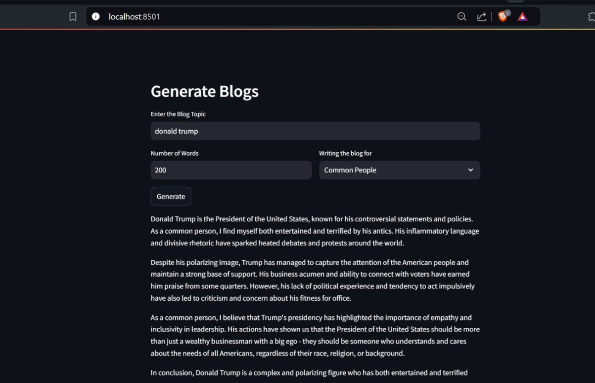
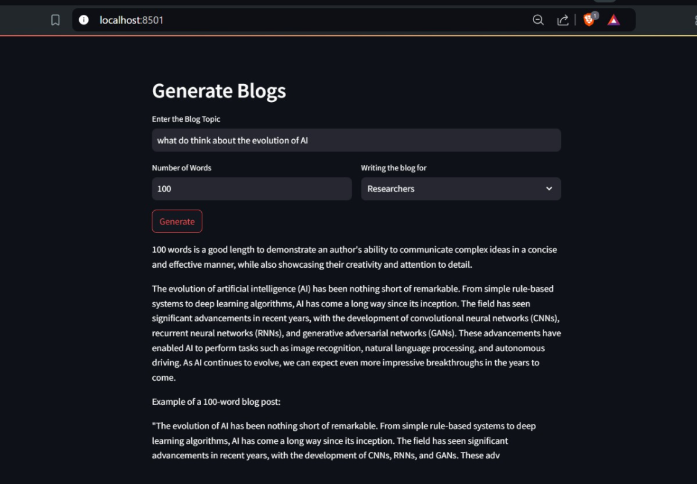
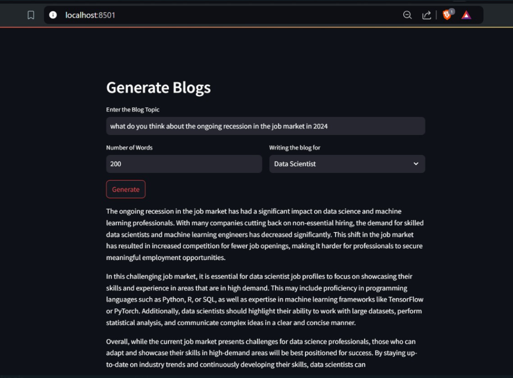

# Blog Generation Model

This repository contains a Streamlit app for generating blogs using the Llama2 model via `ctransformers`.

## Setup Instructions

### 1. Create Conda Environment
Create a new Conda environment with Python 3.9:
```bash
conda create -p venv python=3.9 -y
```

### 2. Activating Conda Environment
Activate the Conda environment:
```bash
conda activate D:\Blog_generation_model\venv
```

### 3. Install Dependencies
Install the required dependencies listed in the requirements.txt file:
```bash
pip install -r requirements.txt
```

### 4. Coding the app.py
Import Necessary Modules
```python
import streamlit as st
from langchain.prompts import PromptTemplate
from ctransformers import AutoModelForCausalLM
```

### 5. Configure Streamlit App
Set the page configuration for the Streamlit app:
```python
st.set_page_config(
    page_title="Generate Blogs",
    page_icon=' ',
    layout='centered',
    initial_sidebar_state='collapsed'
)
```

### 6. Create Input Fields
Create input fields for the blog topic, number of words, and blog style:
```python
st.header('Generate Blogs')
input_text = st.text_input("Enter the Blog Topic")

col1, col2 = st.columns([5, 5])
with col1:
    no_words = st.text_input('Number of Words')
with col2:
    blog_style = st.selectbox('Writing the blog for', ('Researchers', 'Data Scientist', 'Common People'), index=0)

submit = st.button("Generate")
```

### 7. Define the Function to Get Llama Response
Define a function to get the response from the Llama2 model:
```python
def getLLamaresponse(input_text, no_words, blog_style):
    llm = AutoModelForCausalLM.from_pretrained(
        "D:\\Blog_generation_model\\model\\llama-2-7b-chat.ggmlv3.q8_0.bin",
        model_type="llama",
        config={
            'max_new_tokens': 256,
            'temperature': 0.01
        }
    )

    template = """
    write a blog for {blog_style} job profile for a topic {input_text} within {no_words} words.
    """
    prompt = PromptTemplate(input_variables=["blog_style", "input_text", 'no_words'], template=template)

    response = llm(prompt.format(blog_style=blog_style, input_text=input_text, no_words=no_words))
    print(response)
    return response
```

### 8. Generate Blog on Submit
Generate the blog when the submit button is clicked:
```python
if submit:
    st.write(getLLamaresponse(input_text, no_words, blog_style))
```

### 9. Run the App
Run the Streamlit app:
```bash
streamlit run app.py
```
```csharp
Save this content into a file named `README.md` in your GitHub repository. This README file provides clear and concise instructions on how to set up, code, and run your blog generation app using Streamlit and the Llama2 model with `ctransformers`.
```

### EXAMPLES OF THE OUTPUTS:
<h2>using the blog type as common people</h2>

<h2>using the blog type as researchers</h2>

<h2>using the blog type as data analysts</h2>

